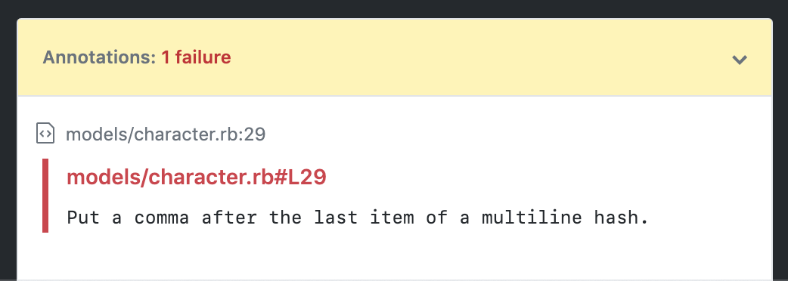

# StandardRB Action

> [!IMPORTANT]
> The [standardrb organization](https://github.com/standardrb) has adopted [another action](https://github.com/standardrb/standard-ruby-action) as their official one so you're probably better off using that one.

Lint your Ruby code in parallel to your builds with [StandardRB](https://github.com/testdouble/standard).
Based almost entirely off the [Rubucop Action](https://github.com/gimenete/rubocop-action) by [Alberto Gimeno](https://github.com/gimenete).



## Example usage

Here's an example running a build matrix and StandardRB:

```yml
name: CI

on: [push]

jobs:
  Build:
    runs-on: ubuntu-latest
    strategy:
      matrix:
        ruby: [ '2.5', '2.6', '2.7' ]
    steps:
    - uses: actions/checkout@v2
    - name: Set up Ruby ${{matrix.ruby}}
      uses: actions/setup-ruby@v1
      with:
        ruby-version: ${{matrix.ruby}}
    - name: Build and test with Rake
      run: |
        gem install bundler
        bundle install --jobs 4 --retry 3
        bundle exec rake
  StandardRB:
    runs-on: ubuntu-latest
    steps:
      - name: standardrb
        env:
          GITHUB_TOKEN: ${{ secrets.GITHUB_TOKEN }}
        uses: amoeba/standardrb-action@v2
```

You can specify a project path if your application is not at the root of the
repository:

```yml
- name: standardrb
  env:
    GITHUB_TOKEN: ${{ secrets.GITHUB_TOKEN }}
    PROJECT_PATH: my_rails_app/
  uses: amoeba/standardrb-action@v2
```

## Common Issues

### `create_check` Forbidden

If a Dependabot-generated branch triggers this action, you might get an error that can be solve by setting the permissions in the yaml:

```yaml
permissions:
  checks: write
  contents: read
```

You can get more context in [this GitHub blog post](https://github.blog/changelog/2021-10-06-github-actions-workflows-triggered-by-dependabot-prs-will-respect-permissions-key-in-workflows/).

## Contributing

Please file an [Issue](https://github.com/amoeba/standardrb-action) for bug reports, feature requests, or other comments.
